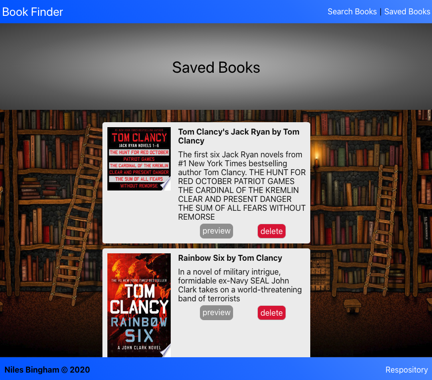

# 
Book Finder

## Visuals

## Overview

Search for your favorite books using the Google Books api. In order to use this app you'll need to do a few things.

1. After cloning the repo run `npm install` to install all the dependancies on your local machine.
2. Add a `.env` file with a Google Books api-key saved as `APIKEY=<your key here>`.
3. Run `npm start` then navigate to `localhost:3000` and start searching!

If you would rather see the deployed version of the application click here.

## Technologies

1. MongoDB with mongoose
2. Express
3. React
4. Node.js

### Roles

**Niles** - Full-Stack Developer
